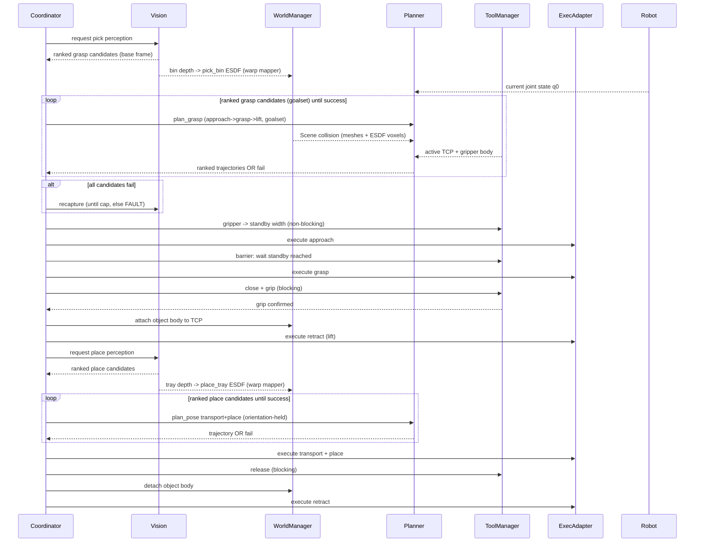

# SPEC.md — GPU Motion Planning Pipeline for Bin Picking

> Build specification. Pair with `CONTEXT.md` (rationale, caveats, glossary) and `architecture.mermaid` (system diagram). Python-first. ROS2 as integration fabric. cuRobo (**v0.8.0 / "curobov2"**) as embedded planning library (no MoveIt2). Perception collision uses cuRobo's **native warp ESDF mapper** — no nvblox.

---

## 1. Goal

Given a robot start configuration, a ranked set of Cartesian goals (grasp, then place), a per-cycle scene captured from camera(s), and static cell geometry, produce and execute collision-free, ranked, dynamically-computed joint trajectories for a pick-and-place cycle. Collision is checked against the scene, the robot itself, and the held workpiece. Tools and grip configurations update at runtime. Built so the structured-light one-shot MVP extends cleanly to live/reactive operation.

## 2. Scope

**MVP (build first)**
- Single robot, 6-DOF. URDF supplied by OEM (treated as authoritative, not modified).
- Single structured-light capture per phase: one-capture → plan → execute.
- Two captures per cycle: pick-side (bin) before pick planning, place-side (tray) before place planning. Place is re-perceived every cycle (parts roll).
- Pick-and-place template: pre-grasp → approach → grasp → retract → transport → place → release → retract.
- Cartesian goal sets for grasp and place; planner owns IK.
- Decoupled tool actuation via sync barriers (no coordinated motion).
- Rigid workpiece: attach known mesh. Per-width gripper collision geometry.
- Execution: planner-as-master via raw TCP socket to an ABB RAPID server (no EGM).
- Validation in Isaac Sim against the same world and trajectory.
- Plan-time budget: < 1 s per planning call.

**Deferred (design hooks only, do not build in MVP)**
- Live/reactive operation (stereo ~10 Hz), cuRobo MPC (`ModelPredictiveControl`), decaying dynamic ESDF layer (native mapper supports EMA decay).
- EGM / ros2_control execution adapters; EtherNet/IP joint-state read.
- Coordinated external axis (rail / turntable), 7-DOF, 6+1.
- Deformable workpiece via post-grasp rescan (rescan completeness is a known open problem).
- Tool-change motion generation (off-cycle mating-point calibration).
- Learned planner / sampler / cost; VLA terminal manipulation skill.
- Multi-arm, multi-robot shared workspace.

## 3. Architecture

ROS2 process hosting cuRobo (curobov2) as a library. See [`architecture.mermaid`](architecture.mermaid) for the system diagram.

Node responsibilities:

| Module | Responsibility |
|---|---|
| Perception Frame Adapter | Normalize every camera's data to the robot **base frame**. Fixed camera: static extrinsic. EIH: extrinsic × FK(capture config). Output base-frame depth + camera pose. |
| Collision World Manager | Maintain cuRobo's `Scene`: persistent static `Cuboid`/`Mesh` + per-cycle ESDF `VoxelGrid` layers (`pick_bin`, `place_tray`) from the native warp mapper + attached-object body. Self-filter the robot from depth. |
| Segment / Constraint Builder | Expand a phase template into `MotionSegment`s. Map the grasp phase onto `plan_grasp` (approach→grasp→lift); map free/transport moves onto `plan_pose` with a pose-cost metric for held constraints. |
| Motion Planner | cuRobo `MotionPlanner`: `plan_pose` (free motion) / `plan_grasp` (native approach→grasp→lift), IK over a `GoalToolPose` goalset, parallel seeds, ranking, validity gate. |
| Tool & Gripper Manager | Tool library, active TCP per tool, gripper collision geometry as a function of commanded width, actuation commands. |
| Task Coordinator | State machine: perception requests, segment sequencing, sync barriers, candidate fallback, recapture, attach/detach. |
| Execution Adapter | OEM-agnostic interface. MVP impl = ABB raw-socket adapter. |
| Joint State Source | Provide current `q0`. MVP impl = read from RAPID socket server. |

## 4. Core data contracts

These are **our** module contracts (not cuRobo's API); the Motion Planner adapts them onto cuRobo's `GoalToolPose` / `plan_pose` / `plan_grasp`. All poses are SE3 in the robot **base frame** unless stated. `Pose = (position_xyz_m, quaternion_wxyz)`.

```python
@dataclass
class GripConfig:
    width_m: float        # commanded jaw opening; DRIVES collision geometry
    force: float          # execution-only, not used by planner
    mode: str             # execution-only, e.g. "inward" | "outward" | "vacuum_on"

@dataclass
class GraspCandidate:
    tcp_pose: Pose            # EXACT target pose (no relaxation), base frame
    approach_axis: Vec3       # unit vector, base frame; usually tool +Z, configurable (XY allowed)
    standoff_m: float         # pre-grasp offset along -approach_axis -> grasp_approach_offset
    tool_id: str
    grip: GripConfig          # grip state to achieve at grasp
    # Priority is implicit in list order. No score field. The ranked list becomes the
    # num_goalset dimension of a cuRobo GoalToolPose (planner selects the reachable one).

@dataclass
class PlaceCandidate:          # symmetric to GraspCandidate
    tcp_pose: Pose             # EXACT, base frame
    approach_axis: Vec3
    standoff_m: float
    tool_id: str
    grip: GripConfig           # release config

@dataclass
class SegmentConstraints:
    linear_approach: bool          # straight-line along approach_axis
    approach_axis: Optional[Vec3]  # frame to align the linear/orientation cost to
    offset_m: float                # standoff for the grasp-approach metric
    hold_orientation: bool         # lock all 3 rotation DOF (e.g. vacuum stays level)
    hold_vec_weight: Tuple6        # cuRobo pose-cost order: [rx,ry,rz, x,y,z] (orientation first)
    min_clearance_m: float         # hard filter threshold (reject below)

@dataclass
class ToolAction:
    tool_id: str
    grip: GripConfig
    blocking: bool                 # if True, coordinator waits for completion (sync barrier)

@dataclass
class MotionSegment:
    name: str                      # "approach"|"grasp"|"retract"|"transport"|"place"|"release"|"free"
    goal: Pose                     # base-frame TCP goal (exact)
    constraints: SegmentConstraints
    pre_action: Optional[ToolAction]   # actuation to complete BEFORE this segment runs
    post_action: Optional[ToolAction]  # actuation to complete AFTER this segment runs

@dataclass
class CollisionBody:
    kind: str                      # "mesh" | "voxel" | "primitive"
    data: Any                      # trimesh / VoxelGrid / primitive params
    frame: str                     # "tcp" for attached object, "base" for world

@dataclass
class ToolDescriptor:
    tool_id: str
    tcp_pose: Pose                              # TCP relative to flange; becomes active TCP
    collision_geom_fn: Callable[[GripConfig], CollisionBody]  # geometry as fn of width
    actuation_iface: str                        # topic/service/socket descriptor
    payload_kg: float

@dataclass
class JointTrajectory:
    joint_names: List[str]
    points: List[Tuple[Vec, Vec, Vec, float]]   # (positions, velocities, accelerations, time_from_start_s)

@dataclass
class PlanResult:
    success: bool
    trajectory: Optional[JointTrajectory]       # timed, dense (internal representation)
    candidate_index: int                        # which goalset entry was selected
    metrics: Dict[str, float]                   # cycle_time, peak_jerk, min_clearance, ...
```

## 5. Module detail

### 5.1 Perception Frame Adapter
- Camera registry: `{camera_id: {mount: "fixed"|"eih", extrinsic: Pose, role: "pick"|"place"|"aux"}}`.
- For EIH, requires the **capture-time joint config** to compute camera→base via FK. Vision must tag captures with that config, or the adapter samples `q` at capture.
- Output: base-frame depth image + base-frame camera pose, ready for ESDF integration by the native mapper.

### 5.2 Collision World Manager (cuRobo curobov2)
- Build one cuRobo `Scene` collision world combining `Cuboid`/`Mesh` (static) and `VoxelGrid` ESDF layers (per-cycle). cuRobo composes these in one collision query.
- **Static cell geometry**: meshes/cuboids loaded once (persistent).
- **Per-cycle perception** (`pick_bin`, `place_tray`): use cuRobo's **native warp `Mapper`** (`curobo._src.perception.mapper`). Per cycle: `mapper.integrate(...)` the base-frame depth → `mapper.compute_esdf()` → `VoxelGrid`, then push it into the collision world via `scene_collision.update_voxel_data(...)`. This is the nvblox replacement — pure warp, no external C++ library.
- Self-filter: zero the robot's region in the depth image before integration (plus cuRobo robot segmentation).
- Attached object: add as a `Mesh`/`Sphere` on the tool frame on grasp confirmation; remove on release. Use `disable_collision_links` to permit object↔gripper contact while still checking object↔arm.
- Re-perceive per cycle by clearing/re-integrating the mapper (or moving the ESDF origin for a sliding window). No nvblox in-process re-init quirk — this is native warp.

### 5.3 Segment / Constraint Builder
- Pre-grasp pose = `grasp.tcp_pose` offset by `standoff_m` along `-approach_axis`.
- **Grasp phase via `plan_grasp`**: cuRobo natively chains **approach → grasp → lift** in one call — `plan_grasp(grasp_poses=GoalToolPose(...), current_state, grasp_approach_axis, grasp_approach_offset=-standoff_m, disable_collision_links=<finger links>)`. Pass the ranked candidates as the `num_goalset` dimension; the planner selects the most reachable. Finger-link collisions are disabled during approach so the gripper can enter tight spaces. Returns approach/grasp/lift interpolated trajectories.
- **Non-Z approach**: `grasp_approach_axis` is a principal axis (`"x"|"y"|"z"`); for an arbitrary `approach_axis`, align the tool/constraint frame so the approach maps to that principal axis (curobov2 linear approach is axis-aligned in the chosen frame).
- **Transport (carry) hold-orientation**: for vacuum/suction tools, plan the transport move with `plan_pose` plus a **pose-cost metric** (`curobo._src.cost.cost_pose_metric`, params `offset_position` / `tstep_fraction` / `linear_axis`) configured to hold orientation — `hold_orientation=True`, `hold_vec_weight=[1,1,1,0,0,0]` (orientation first) — to keep the face level and minimize peel force.
- **Retract / place-approach**: straight-line along the approach axis; place-approach is collision-aware against the re-perceived `place_tray` ESDF `VoxelGrid` and the attached object.
- `min_clearance_m` acts as a hard filter; cycle time and smoothness are the soft objectives (Section 8).

### 5.4 Tool & Gripper Manager
- Tool library keyed by `tool_id`; switching updates the **active TCP** (the tool frame in `GoalToolPose.tool_frames` / kinematics EE link).
- Gripper collision geometry is a function of commanded `width_m` (Section 4 `collision_geom_fn`). Always reflect the **actual commanded width per segment** (open/standby width during approach is wider and must clear neighbors). Never use a fixed worst-case envelope (false negatives).
- `force` and `mode` are passed to actuation only; planner ignores them.
- Grasp transform (object pose in gripper) derived from `object_pose ⊖ grasp_pose`, used to place the attached body relative to the TCP.

### 5.5 Task Coordinator (state machine)
States: `PERCEIVE_PICK → PLAN_PICK → EXEC_PICK → PERCEIVE_PLACE → PLAN_PLACE → EXEC_PLACE → DONE`, with `RECAPTURE` and `FAULT`. Owns sync barriers and attach/detach. See sequence in Section 6.

### 5.6 Execution Adapter
- Interface: `send_trajectory(traj) -> handle`, `read_joint_state() -> q`, `stop()`.
- **ABB raw-socket adapter (MVP):**
  1. Down-sample the dense cuRobo trajectory to waypoints (curvature/error-bounded), assign `speeddata` and corner `zonedata` for blending.
  2. Stream waypoints into the RAPID server's ring buffer, keeping **≥ N points buffered ahead** so RAPID look-ahead blends corners (sending one-at-a-time blocking causes a stop at every point).
  3. RAPID server: socket listener + motion task, executes `MoveAbsJ` with zones, reports joint feedback on the same or a sibling channel.
- Adapter boundary is fixed so EGM / ros2_control adapters drop in later without touching upstream. Reuse the existing asyncio TCP socket manager (fixed-header framing) for the PC side.

### 5.7 Joint State Source
- MVP: parse joint feedback from the RAPID socket server. Provide `q0` to the planner as the trajectory start.
- Hook for an alternative EtherNet/IP read from the controller (deferred).

## 6. Per-cycle sequence



## 7. Fallback and recapture ladder

1. Unit of "a plan" = one cuRobo `plan_pose`/`plan_grasp` call (each evaluates many seeds in parallel; `plan_grasp` also tries the whole grasp goalset).
2. Candidate fails only when its plan call fails **and** optional retries (standoff / approach variants) also fail.
3. On candidate failure, advance to the next ranked candidate (next goalset entry).
4. When all candidates fail, trigger `RECAPTURE` (re-perceive), up to `recapture_cap` (default 3). Beyond the cap, raise `FAULT`.
5. Same ladder applies independently to grasp and place phases.

## 8. Planning configuration

- Goal: Cartesian `tcp_pose` per candidate, supplied as a `GoalToolPose` goalset; the planner enumerates IK branches and returns the best of parallel seeds.
- Robot model: cuRobo plans from a robot config (collision-sphere model, EE/TCP link, locked joints), **authored from the URDF — the URDF alone is not enough**. Tune the sphere model: too coarse rejects valid plans, too fine slows the collision kernel. Tool swaps update the active EE link / TCP offset here.
- Objectives (soft): cycle time, smoothness (cuRobo minimum-jerk). Path length is a byproduct.
- Filter (hard): `min_clearance_m`; joint position/velocity/acceleration/jerk limits from URDF.
- Manipulability: off by default. Add a manipulability or joint-velocity-margin cost only if near-singular slowdowns/wrist flips are observed.
- Constraints: the grasp approach is built into `plan_grasp`; held-orientation / partial-pose constraints use the pose-cost metric (`offset_position` / `tstep_fraction` / `linear_axis`; soft costs — tune weights; will not land exactly on the offset pose).
- Budget: < 1 s per planning call (expect tens of ms typical on the target GPU — measured ~30 ms `plan_pose` on an RTX 5080). This is **steady-state**: the first plan call JIT-compiles `curobolib` (via `cuda.core`) + warp kernels and captures CUDA graphs (~10–15 s), so call `planner.warmup(enable_graph=True)` at node startup before serving real requests.

## 9. Validation and acceptance

- Isaac Sim digital twin loads the same URDF and the same `WorldSnapshot`; the planned trajectory executes in sim before/instead of hardware (Execution Adapter has an Isaac target).
- Acceptance (MVP):
  - Plans a full pick-and-place for a rigid part against bin + static cell + re-perceived tray, collision-free in sim.
  - Honors straight-line approach/retract and orientation-hold-on-carry constraints.
  - Demonstrates candidate fallback and recapture.
  - Down-sampled waypoints execute smoothly on the RAPID socket server (no per-point stalls) with correct joint feedback.
  - End-to-end planning call < 1 s.

## 10. Repositories and dependencies

- **cuRobo v0.8.0 ("curobov2")** (`NVlabs/curobo`): motion generation, IK, collision, constrained planning, **native warp depth→ESDF perception mapper**, world composition. Standalone Python; embed directly. Public API: `curobo.motion_planner.{MotionPlanner,MotionPlannerCfg}`, `curobo.types.{GoalToolPose,JointState,Pose}`, `curobo.scene.{Scene,Cuboid,Mesh,Sphere}`. `curobolib` JIT-compiles its CUDA kernels at runtime via NVIDIA `cuda.core` (no pre-built C++ extension); warp ≥ 1.12.
- **Perception (depth → ESDF)**: cuRobo's native warp `Mapper` (block-sparse TSDF/ESDF). **No nvblox** — the external nvblox fork does not build on the CUDA 12.8 / Blackwell stack, and curobov2 absorbed the capability natively. Camera-perception collision is reliable in **sparse** environments; dense bin clutter is owned by vision (see CONTEXT caveats).
- **ROS2** (Jazzy via RoboStack): node lifecycle, TF (frame management for fixed/EIH), topics/services/actions between modules, parameters, RViz. No MoveIt2.
- **Isaac Sim 6.0**: validation twin (own pixi env, Python 3.12; talks to the planner over DDS). 5.1's RTX renderer crashes on Blackwell + driver 595; 6.0 fixed it.
- **ABB execution**: custom RAPID socket server + PC-side asyncio socket manager. No EGM in MVP.
- GPU/runtime: CUDA 12.8 + cu128 torch on a Blackwell (sm_120) GPU; mirror the validated dev setup (see INSTALL.md).

## 11. Configuration parameters (defaults; all overridable)

| Param | Default | Notes |
|---|---|---|
| `standoff_m` (→ `grasp_approach_offset`) | 0.05 | placeholder until vision supplies per-candidate |
| `grasp_approach_axis` | `"z"` | tool-frame principal axis for approach |
| `grasp_approach_tstep_fraction` | 0.6 | when the approach constraint activates |
| `min_clearance_m` | 0.01 | hard filter |
| `hold_vec_weight (vacuum carry)` | [1,1,1,0,0,0] | lock orientation (orientation first) |
| `plan_time_budget_s` | 1.0 | per planning call |
| `recapture_cap` | 3 | before FAULT |
| `waypoint_buffer_depth` | 5 | RAPID look-ahead points |
| `esdf_voxel_size (bin/tray)` | 0.005–0.01 | mapper voxel size; tune per part scale |

## 12. Open items / TODO (deferred, keep interfaces ready)

- Live/reactive mode: cuRobo MPC (`ModelPredictiveControl`, public in curobov2) + decaying dynamic ESDF layer (native mapper supports EMA-like decay for dynamic scenes); replan budget << 1 s.
- EGM and ros2_control execution adapters; EtherNet/IP joint read.
- Coordinated external axis (rail/turntable), 7-DOF, 6+1: add joints to the planned chain (config-only on the planning side); execution sync is the real work.
- Deformable workpiece: post-grasp rescan; handle partial-object scan gaps.
- Tool-change motion generation; off-cycle mating-point calibration.
- Learned cost/sampler or VLA terminal skill behind the cuRobo validity gate.
- Functional safety: software avoidance is not safety-rated; safety hardware (scanners, safety-rated monitored stop) is required for any shared-workspace operation.
